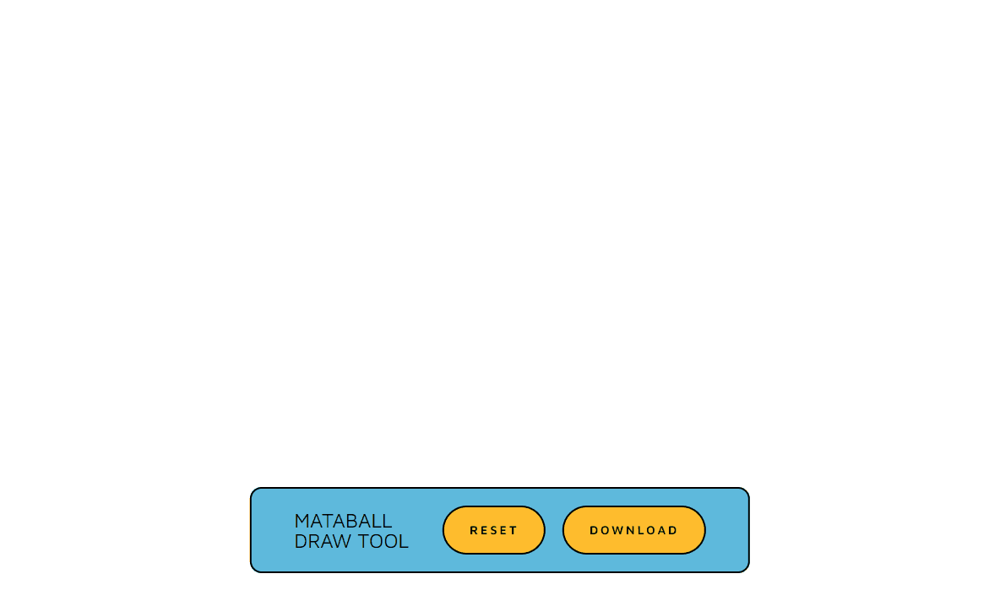

# metaballDrawTool


Drag to draw a metaball on the canvas.

## Usage

```bash
git clone https://github.com/heutronica/metaballDrawTool.git
npm install
npm run dev
```

## License

metaballDrawTool is under [MIT license](https://en.wikipedia.org/wiki/MIT_License).
